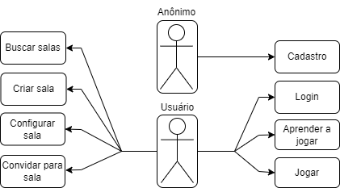
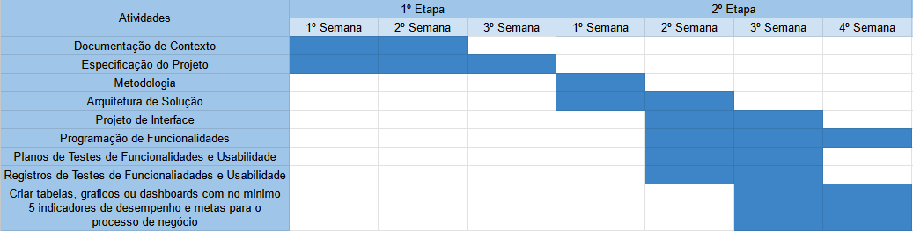
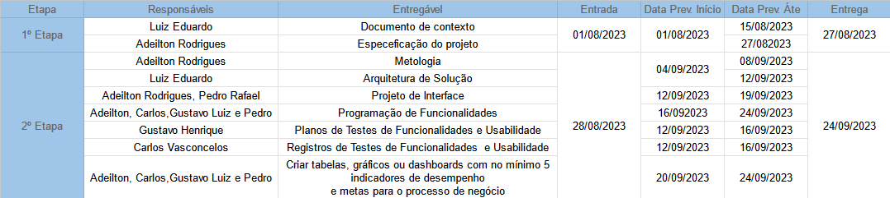
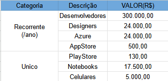

# Especificações do Projeto

A definição exata do problema e outros pontos relevantes a serem tratados no projeto estão descritos aqui. Eles foram levantados e produzidos usando as seguintes ferramentas e tecnicas: 

1. Entrevistas e Discussões com jogadores e desenvolvedores
2. Documentação de Requisito
3. Ferramentas de Modelagem Visual (draw.io)
4. Ferramentas de Gerenciamento de Projetos (Github Projects)

## Personas

<!-- Tabela gerada apartir do arquivo: ./persona1.tgn -->

<table>
<thead>
  <tr>
    <th rowspan="2"></th>
    <th colspan="2">Paulo André da Silva</th>
  </tr>
  <tr>
    <th>● Idade: 22 anos. ● Ocupação: Estudante de faculdade.</th>
    <th>● Joga com os amigos no final do horário da faculdade.</th>
  </tr>
</thead>
<tbody>
  <tr>
    <td>Motivação: &emsp;● Jogar com os amigos. &emsp;● Conhecer pessoas que támbem gostam de jogos de dedução social.</td>
    <td>Objetivo: &emsp;● Conseguir jogar com os amigos mesmo fora da faculdade.</td>
    <td>Frustração: &emsp;● Não conseguir se encontrar com os amigos após as aulas. &emsp;● Só poder jogar no máximo com 6 pessoas.</td>
  </tr>
</tbody>
</table>

<!-- Tabela gerada apartir do arquivo: ./persona2.tgn -->

<table>
<thead>
  <tr>
    <th rowspan="2"></th>
    <th colspan="2">Lara Rocha Pinto</th>
  </tr>
  <tr>
    <th>● Idade: 18 anos. ● Ocupação: Influenciadora digital.</th>
    <th>● Faz lives jogando com seus seguidores.</th>
  </tr>
</thead>
<tbody>
  <tr>
    <td>Motivação:      ● Divertir-se jogando seu jogo favorito.</td>
    <td>Objetivo:      ● Jogar com os fãs.</td>
    <td>Frustração:      ● jogo de cartas favorito ainda não foi virtualizado.</td>
  </tr>
</tbody>
</table>

## Histórias de Usuários

Com base na análise das personas forma identificadas as seguintes histórias de usuários:

<!-- Tabela gerada apartir do arquivo: ./historias-usuario.tgn -->

| ID   	| Persona              	| Funcionalidade                                            	| Motivo/Valor                                               	|
|------	|----------------------	|-----------------------------------------------------------	|------------------------------------------------------------	|
| HU-1 	| Lara Rocha Pinto     	| Criar e compartilhar sessões de Coup                      	| Jogar com seus fãs e produzir conteudo                     	|
| HU-2 	| Paulo André da Silva 	| Ver as ações e decisões de outros jogadores em tempo real 	| Conseguir montar estratégias para ganhar                   	|
| HU-3 	| Lara Rocha Pinto     	| Interagir no jogo através de uma interface intuitiva      	| Não precisar explicar tanto o jogo para pessoas assistindo 	|
| HU-4 	| Lara Rocha Pinto     	| Configurar regras para as sessões de Coup                 	| Ter maior controle sobre as partidas                       	|

## Modelagem do Processo de Negócio 

### Análise da Situação Atual

Apresente aqui os problemas existentes que viabilizam sua proposta. Apresente o modelo do sistema como ele funciona hoje. Caso sua proposta seja inovadora e não existam processos claramente definidos, apresente como as tarefas que o seu sistema pretende implementar são executadas atualmente, mesmo que não se utilize tecnologia computacional. 

### Descrição Geral da Proposta

Apresente aqui uma descrição da sua proposta abordando seus limites e suas ligações com as estratégias e objetivos do negócio. Apresente aqui as oportunidades de melhorias.

### Processo 1 – NOME DO PROCESSO

Apresente aqui o nome e as oportunidades de melhorias para o processo 1. Em seguida, apresente o modelo do processo 1, descrito no padrão BPMN. 

### Processo 2 – NOME DO PROCESSO

Apresente aqui o nome e as oportunidades de melhorias para o processo 2. Em seguida, apresente o modelo do processo 2, descrito no padrão BPMN.

## Indicadores de Desempenho

Apresente aqui os principais indicadores de desempenho e algumas metas para o processo. Atenção: as informações necessárias para gerar os indicadores devem estar contempladas no diagrama de classe. Colocar no mínimo 5 indicadores. 

Usar o seguinte modelo: 

Obs.: todas as informações para gerar os indicadores devem estar no diagrama de classe a ser apresentado a posteriori. 

## Requisitos

As tabelas que se seguem apresentam os requisitos funcionais e não funcionais que detalham o escopo do projeto. Para determinar a prioridade de requisitos, aplicar uma técnica de priorização de requisitos e detalhar como a técnica foi aplicada.

### Requisitos Funcionais

<!-- Tabela gerada apartir do arquivo: ./requisitos-funcionais.tgn -->

| ID   	| Descrição do Requisito                                                                                                  	| Prioridade 	|
|------	|-------------------------------------------------------------------------------------------------------------------------	|------------	|
| RF-1 	| Os jogadores devem ser capazes de criar salas de partida online                                                         	| ALTA       	|
| RF-2 	| Os jogadores devem poder escolher o nome da sala, o número máximo de jogadores e as regras da partida ao criar uma sala 	| ALTA       	|
| RF-3 	| A partida deve seguir o fluxo de jogo esperado, com turnos, condições de vitoria e derrota                              	| ALTA       	|

### Requisitos não Funcionais

<!-- Tabela gerada apartir do arquivo: ./requisitos-funcionais.tgn -->

| ID    	| Descrição do Requisito                                                                   	| Prioridade 	|
|-------	|------------------------------------------------------------------------------------------	|------------	|
| RNF-1 	| O jogo deve estar disponivel para dispositivos móveis                                    	| ALTA       	|
| RNF-2 	| A interface precisa expressar as regras do jogo de maneira intuitiva e facil de aprender 	| ALTA       	|
| RNF-3 	| As informações relevantes dos jogadores precisam estar protegidas de acessos indevidos   	| ALTA       	|
| RNF-4 	| O codigo precisa ser criado para facilitar manuntenção e extensão futura                 	| MEDIA      	|

## Restrições

O projeto está restrito pelos itens apresentados na tabela a seguir.

|ID| Restrição                                             |
|--|-------------------------------------------------------|
|R-1| O projeto deverá ser entregue até o final do semestre |

## Diagrama de Casos de Uso

# Matriz de Rastreabilidade

| Requisito     | Historias de usuario  |
|---------------|-----------------------|
| RF-1          | HU-01                 |
| RF-2          | HU-04                 |
| RF-3          |                       |
| RNF-1         | HU-01, HU-03          |
| RNF-2         | HU-03                 |

# Gerenciamento de Projeto

## Gerenciamento de Tempo

<!--Tabala feita no exel se encontra em: ./tabela-gerenciamento-tempo.xlsx-->

## Gerenciamento de Equipe

<!--Tabala feita no exel se encontra em: ./tabela-gerenciamento-equipe.xlsx-->

## Gestão de Orçamento

<!--Tabala feita no exel se encontra em: ./tabela-gestao-orcamento.xlsx-->

