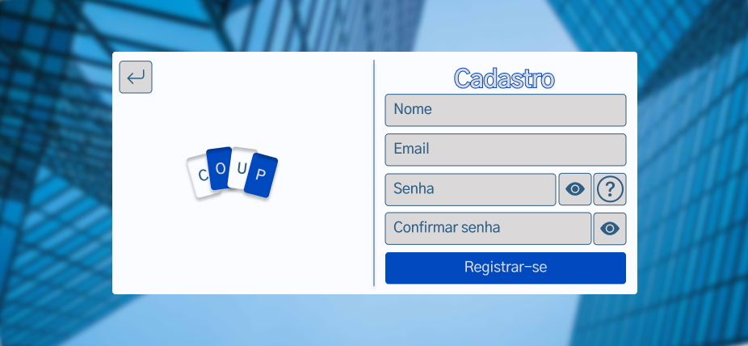
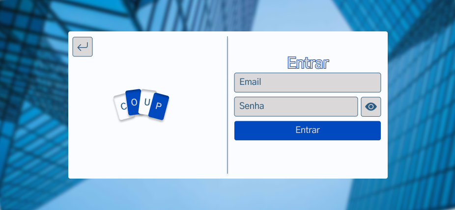
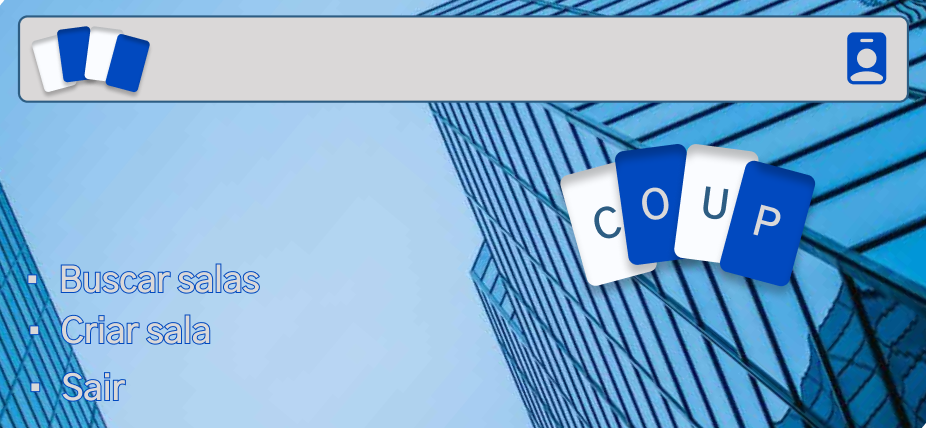
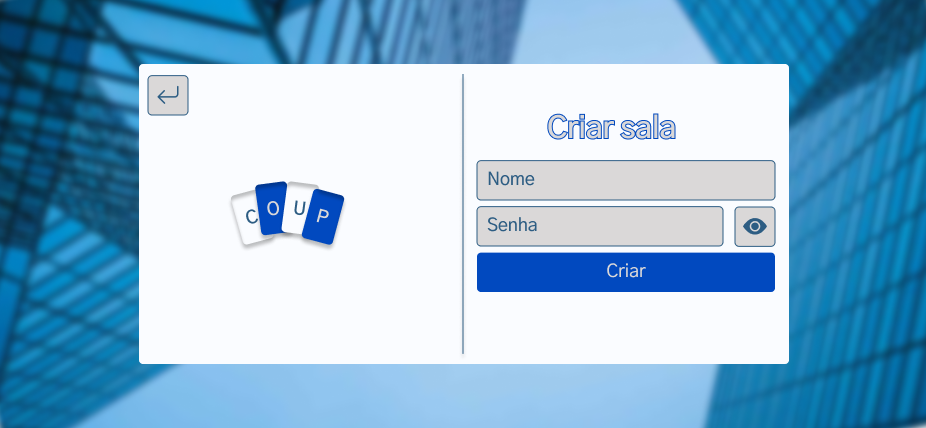
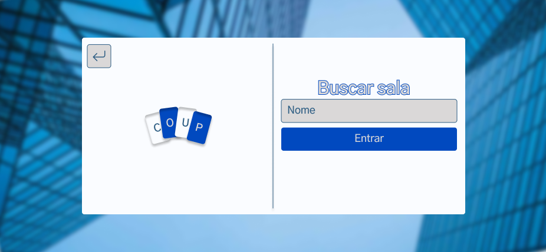

## Splash Art
A art que representa o jogo.

## Início
A tela de início permite que o usuário entre, registre-se ou saia.

## Registrar-se
Na tela de realizar o registro é possível preencher os campos: Nome, Email do usuário, Senha e Confirmar senha; e então, os dados poderão ser salvos e também é possível retornar ao início.

## Entrar
Na tela de realizar login é possível preencher os campos de email do usuário e senha do usuário para acessar a plataforma.

## Home
A home, permite que o usuário Crie ou Busque salas ou saia da conta.

## Criar Sala
Na tela de criar sala, é possível dar nome a uma sala e opcionalmente uma senha para poder criar um grupo

## Buscar Sala
Na tela de buscar sala, é possível encontrar salas já criadas para poder participar do jogo em grupo

